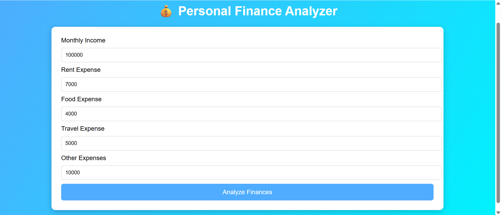

# 💰 Personal Finance Analyzer

Personal Finance Analyzer is a simple web application that helps users understand their spending habits.  
The system analyzes monthly income and expenses and generates graphs along with financial suggestions to improve budgeting.

The project uses **Flask (Python)** for the web backend and **Octave** for financial analysis and visualization.

---

## 🚀 Features

- 📊 Expense Distribution Pie Chart  
- 📈 Savings Growth Graph  
- 📊 Expense Comparison Bar Chart  
- 💡 Financial Suggestions based on spending patterns  
- 🌐 Simple and interactive web interface

---

## 🛠 Technologies Used

- Python  
- Flask  
- Octave  
- HTML  
- CSS  

---

## ⚙️ How It Works

1. The user enters financial details (income and expenses).
2. Flask processes the input and runs an Octave script.
3. Octave analyzes the data and generates graphs.
4. Financial suggestions are created based on spending habits.
5. Results are displayed on the website.

---

### 📸 Preview


### 📁 Project Setup
```bash
1. Clone the repo:
git clone https://github.com/vinaya2007/Personal-Finance-Analyzer.git


2. Navigate to the project folder:
cd Personal-Finance-Analyzer

3. Open index.html in your browser.
```

📬 Contact 

📧 vinayavinodh07@gmail.com 

📞 +91 90032 80933

Credits Built by Vinaya V

